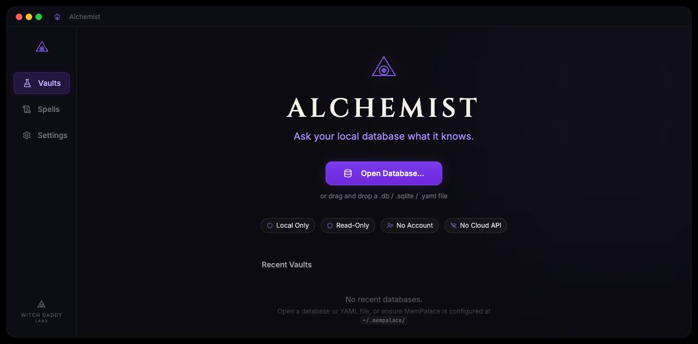
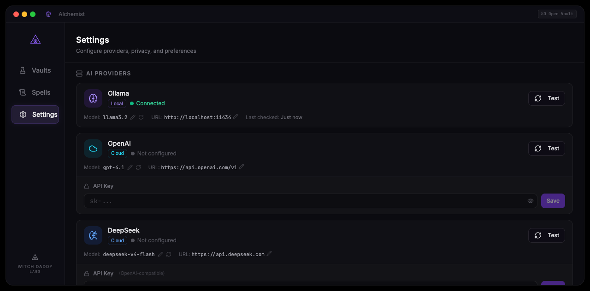
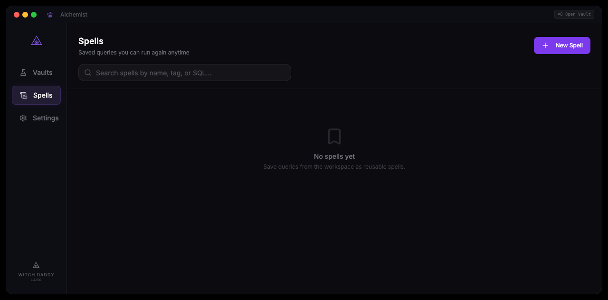

# Alchemist

[](LICENSE)
[](CHANGELOG.md)
[](https://www.apple.com/macos)
[](https://www.rust-lang.org)
[](https://v2.tauri.app)
[](https://witchdaddylabs.com)

> **Ask your local data what it knows.** A local-first macOS app that opens your databases, MemPalace, and config files — and lets you ask questions in plain English.

<div align="center">
  
</div>

---

## ✨ What it does

Alchemist turns your local data into a conversation. Open a SQLite database, point it at your MemPalace, or drop in a YAML file — then just ask questions.

**Drop in a database, ask a question, get answers.** No cloud, no accounts, no data leaves your machine.

```
You: "How many users signed up last month?"
Alchemist: SELECT COUNT(*) FROM users WHERE created_at >= date('now', '-30 days')
           → 1,247 users
```

### Features

| | |
|---|---|
| 🗄️ **SQLite** | Open any `.db` or `.sqlite` file — read-only, safe, can't accidentally modify your data |
| 🧠 **MemPalace** | Connect to your palace, browse wings and rooms, search by meaning |
| 💬 **Natural language** | Just ask. Alchemist generates safe SQL from your question |
| 🔍 **SQL preview** | See the SQL before it runs. Edit it, cancel it, or approve it |
| 📊 **Charts** | Results as bar, line, or pie charts — auto-detects numeric columns |
| ✨ **Saved spells** | Name and reuse your best queries across sessions |
| 🤖 **Your model, your rules** | Ollama (local), OpenAI, Google Gemini, DeepSeek — or any OpenAI-compatible provider |
| 🔒 **Private by design** | No telemetry, no accounts, no cloud dependency. Keys in macOS Keychain |

---

## 🚀 Quick start

### Download

Grab the latest DMG from [Releases](https://github.com/witchdaddylabs/alchemist/releases). Mount it, drag to Applications, open it.

*Requires macOS 13 (Ventura) or later. Apple Silicon or Intel.*

### Setup a provider

Alchemist needs an AI model to generate queries from your questions.

**Local (free, private):**
1. Install [Ollama](https://ollama.com)
2. Pull a model: `ollama pull llama3.2`
3. Open Alchemist — Ollama is auto-detected

**Cloud (bring your own key):**
- OpenAI, Google AI Studio, DeepSeek — or any OpenAI-compatible endpoint (Groq, Together, vLLM, etc.)
- Add your API key in Settings → pick a provider

<div align="center">
  
</div>

### Your first query

1. **Open Alchemist** — it auto-loads MemPalace if you have one
2. **Or drag a database** — any `.db` file onto the vault screen
3. **Type a question** — "show me my tables" or "how many records?"
4. **Review the SQL** — Alchemist shows you what it's about to run
5. **Hit Run** — see results as a table or chart
6. **Save it** — click "Save as Spell" to reuse later

<div align="center">
  
</div>

---

## 🛠️ Development

```bash
git clone https://github.com/witchdaddylabs/alchemist.git
cd alchemist
npm install
npm run tauri dev
```

### Stack

| Layer | What |
|-------|------|
| Desktop | **Tauri v2** — lightweight native shell |
| Frontend | **React 19**, **TypeScript**, **Vite** |
| UI | **shadcn/ui** (dark mode, purple neon accents) |
| State | **Zustand** |
| Backend | **Rust** — SQLite, ChromaDB, MemPalace parsing |
| SQL safety | **sqlparser-rs** — SELECT-only, single statement, auto-LIMIT |
| AI providers | Ollama, OpenAI, Gemini, DeepSeek, custom OpenAI-compatible |
| Auto-update | **tauri-plugin-updater** — checks GitHub Releases on launch |

### Project layout

```
src/                          # React frontend
├── features/vault/           # File picker, recent sources
├── features/workspace/       # Schema sidebar, chat, inspector panels
├── features/results/         # Tables, charts, export
├── features/spells/          # Saved query library
├── features/settings/        # Provider config, API keys, privacy
└── state/                    # Zustand stores

src-tauri/src/                # Rust backend
├── db.rs                     # Read-only SQLite
├── chroma.rs                 # ChromaDB vector search
├── palace.rs                 # MemPalace YAML parser
├── llm.rs                    # Prompt builder, query generation
├── providers/                # Ollama, OpenAI, Gemini clients
├── secret_store.rs           # macOS Keychain
├── validate.rs               # sqlparser-rs safety checks
├── models.rs                 # Shared type contracts
├── errors.rs                 # Error types
└── commands/app.rs           # 17 Tauri commands
```

---

## 🔐 Security

- **Read-only by design** — SQLite opened with `SQLITE_OPEN_READONLY`
- **SQL validation** — every query parsed by `sqlparser-rs`: blocks writes, multi-statements, dangerous pragmas
- **Keychain storage** — API keys live in macOS Keychain, never in plaintext files
- **No telemetry** — zero analytics, crash reporting, or network calls to WDL servers
- **Open source** — MIT licensed. Build it yourself if you want

---

## 🧩 What's next?

Alchemist is fully functional and shippable. A few things we're thinking about:

| Feature | Why it's cool |
|---------|---------------|
| **Pagination** | Load-more for results over 1,000 rows |
| **Multi-source queries** | Cross-reference SQLite + ChromaDB in one chat |
| **Plugin architecture** | Postgres, MySQL, CSV support as plugins |
| **Native export dialog** | macOS save dialog for CSV/JSON exports |

Want to help? PRs welcome!

---

<div align="center">
  <sub>Built by <a href="https://witchdaddylabs.com">Witch Daddy Labs</a> in Melbourne, Australia.</sub>
  <br>
  <sub>MIT License · Copyright (c) 2026 Billy @ Witch Daddy Labs</sub>
</div>
